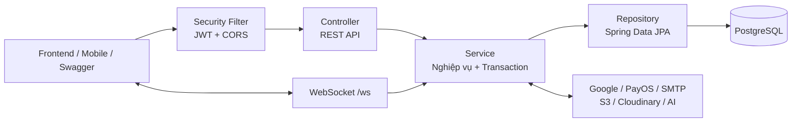

# FilmTicket Backend - Kiến trúc hệ thống

Backend của FilmTicket là một **modular monolith** xây dựng bằng Java 17 và Spring Boot 3.2.0. Ứng dụng cung cấp REST API và WebSocket cho nền tảng đặt vé, thanh toán, xem phim trực tuyến, cộng đồng, loyalty và vận hành rạp.

## 1. Công nghệ sử dụng

| Nhóm | Công nghệ | Vai trò |
|---|---|---|
| Ngôn ngữ và framework | Java 17, Spring Boot 3.2.0 | Nền tảng chính của ứng dụng |
| API | Spring Web, Jakarta Validation | REST API, kiểm tra request |
| Realtime | Spring WebSocket | Đồng bộ đặt vé nhóm và các sự kiện thời gian thực qua `/ws` |
| Bảo mật | Spring Security, JWT (JJWT), BCrypt | Xác thực stateless, phân quyền theo vai trò |
| Dữ liệu | Spring Data JPA, Hibernate | ORM và truy cập dữ liệu |
| Cơ sở dữ liệu | PostgreSQL | Lưu dữ liệu nghiệp vụ |
| Migration | Flyway | Quản lý phiên bản schema và dữ liệu seed |
| Tài liệu API | SpringDoc OpenAPI, Swagger UI | Mô tả và thử REST API |
| Email và tài liệu | Spring Mail, OpenPDF, ZXing | Gửi email, tạo vé PDF và mã QR |
| Lưu trữ | Amazon S3, Cloudinary | Video/poster và ảnh cộng đồng |
| Tích hợp | Google OAuth, PayOS, Gemini/OpenAI | Đăng nhập, thanh toán và chức năng AI |
| Vận hành | Spring Boot Actuator, Docker | Health check, đóng gói và triển khai |
| Build và test | Maven, JUnit/Spring Boot Test | Quản lý dependency, build và kiểm thử |

## 2. Kiểu kiến trúc

Ứng dụng được tổ chức theo **kiến trúc phân lớp** trong một tiến trình triển khai duy nhất:



Đây không phải microservice. Các nhóm chức năng nằm chung trong một Spring Boot application, nhưng được tách theo controller, service, repository và model để dễ bảo trì.

### Luồng xử lý REST điển hình

1. Client gửi HTTP request, kèm JWT nếu API yêu cầu đăng nhập.
2. `JwtAuthenticationFilter` xác thực token và tạo security context.
3. Controller nhận request, kiểm tra DTO và gọi service.
4. Service xử lý nghiệp vụ; các thao tác cần tính nhất quán chạy trong transaction.
5. Repository đọc hoặc ghi PostgreSQL thông qua JPA/Hibernate.
6. Controller trả response DTO về client; lỗi được chuẩn hóa bởi global exception handler.

## 3. Cấu trúc mã nguồn

```text
backend/
├── pom.xml                         # Dependency và cấu hình Maven
├── Dockerfile                      # Multi-stage build bằng Java 17
└── src/
    ├── main/
    │   ├── java/com/filmticket/
    │   │   ├── config/             # Security, CORS, OpenAPI, WebSocket, seed
    │   │   ├── controller/         # REST endpoint theo vai trò/nghiệp vụ
    │   │   ├── dto/                # Request và response model của API
    │   │   ├── entity/             # Entity ánh xạ bảng PostgreSQL
    │   │   ├── exception/          # Exception nghiệp vụ và xử lý lỗi tập trung
    │   │   ├── model/              # Enum/value model hỗ trợ nghiệp vụ
    │   │   ├── repository/         # Spring Data JPA repository
    │   │   ├── scheduler/          # Tác vụ định kỳ xử lý booking hết hạn
    │   │   ├── security/           # JWT, Google token, UserDetails
    │   │   ├── service/            # Logic nghiệp vụ và ranh giới transaction
    │   │   ├── util/               # Tiện ích tạo PDF/QR và xử lý chung
    │   │   └── websocket/          # Handler, xác thực và session realtime
    │   └── resources/
    │       ├── application.properties
    │       └── db/migration/        # Flyway migration V1, V2, ...
    └── test/                        # Unit/integration test
```

Nguyên tắc phụ thuộc chính:

```text
controller -> service -> repository -> entity/database
     |           |
     v           v
    dto     external integrations
```

Controller không nên truy cập repository trực tiếp. Nghiệp vụ, transaction và phối hợp nhiều repository thuộc về service. Entity dùng cho persistence; DTO là hợp đồng dữ liệu với client.

## 4. Các module nghiệp vụ chính

| Module | Phạm vi |
|---|---|
| Authentication & User | Đăng ký, đăng nhập email/Google, access/refresh token, quản lý người dùng |
| Movie & Showtime | Phim, rạp, phòng chiếu, ghế, suất chiếu và giá vé |
| Booking & Payment | Giữ ghế, đặt vé cá nhân/nhóm, combo, PayOS, vé PDF/QR, hoàn tiền |
| Online Streaming | Cấp URL xem phim có thời hạn, watch party, phiên xem và thống kê lượt xem thật |
| Community | Review, comment, bài đăng, reaction, follow, nhắn tin và danh sách yêu thích |
| Loyalty & Promotion | Điểm thưởng, phần thưởng, mã giảm giá và lịch sử sử dụng |
| Staff Operations | Báo cáo, khách hàng, ca làm, chấm công, lương và tồn kho |
| Intelligence & AI | Chatbot phim, tóm tắt review, dự báo nhu cầu và gợi ý nghiệp vụ |
| Realtime | Cập nhật trạng thái đặt vé nhóm và tương tác cần đồng bộ qua WebSocket |

## 5. Dữ liệu và tính nhất quán

- PostgreSQL là nguồn dữ liệu chính; datasource dùng HikariCP.
- Flyway chạy khi ứng dụng khởi động. Hibernate đặt `ddl-auto=validate`, vì vậy schema phải được thay đổi bằng migration thay vì để Hibernate tự tạo bảng.
- `open-in-view=false`; dữ liệu cần cho response phải được lấy hoặc ánh xạ trong service transaction.
- Các service dùng `@Transactional` để đảm bảo các thay đổi liên quan được commit hoặc rollback cùng nhau.
- Luồng giữ/đặt ghế khóa các bản ghi seat availability trước khi kiểm tra và cập nhật, giúp ngăn hai giao dịch bán cùng một ghế.
- Booking hết hạn được quét định kỳ bởi scheduler. Email xác nhận booking được kích hoạt bằng application event sau khi transaction commit thành công.

## 6. Xác thực và phân quyền

Backend dùng JWT theo mô hình stateless; không lưu HTTP session. Mật khẩu được băm bằng BCrypt.

Các vai trò chính:

- `ADMIN`: quản trị hệ thống.
- `STAFF`: vận hành rạp.
- `MEMBER`: khách hàng đã đăng nhập.

Quy ước route:

- `/api/auth/**`: các luồng xác thực công khai được khai báo trong `SecurityConfig`.
- `/api/admin/**`: chỉ `ADMIN`.
- `/api/staff/**`: `STAFF` hoặc `ADMIN`.
- `/api/member/**`, `/api/users/**`: `MEMBER`, `STAFF` hoặc `ADMIN`.
- Một số API đọc phim, suất chiếu, review/comment và webhook thanh toán được public có chủ đích.
- Các API `/api/**` còn lại yêu cầu xác thực.

WebSocket tại `/ws` có interceptor xác thực riêng và dùng cùng danh sách origin với CORS của REST API.

## 7. Tích hợp bên ngoài

| Hệ thống | Mục đích | Biến cấu hình chính |
|---|---|---|
| Google OAuth | Xác minh Google ID token | `GOOGLE_CLIENT_ID`, `GOOGLE_CLIENT_SECRET` |
| PayOS | Tạo thanh toán và xác minh webhook | `PAYOS_CLIENT_ID`, `PAYOS_API_KEY`, `PAYOS_CHECKSUM_KEY` |
| SMTP | Email xác nhận và thông báo | `MAIL_HOST`, `MAIL_PORT`, `MAIL_USERNAME`, `MAIL_PASSWORD` |
| Amazon S3 | Video streaming/poster và URL có thời hạn | `STREAMING_S3_BUCKET`, `STREAMING_S3_REGION`, access/secret key |
| Cloudinary | Lưu ảnh cộng đồng | `CLOUDINARY_CLOUD_NAME`, API key/secret |
| Gemini/OpenAI | Chatbot và xử lý nội dung AI | `GEMINI_API_KEY`, `OPENAI_API_KEY` |

Không commit khóa bí mật vào Git. Hãy cung cấp chúng qua biến môi trường ở máy local hoặc nền tảng triển khai.

## 8. Cấu hình quan trọng

File cấu hình chính: `src/main/resources/application.properties`.

| Biến môi trường | Bắt buộc | Ý nghĩa |
|---|---:|---|
| `DB_URL`, `DB_USER`, `DB_PASS` | Có | Kết nối PostgreSQL |
| `JWT_SECRET` | Có | Khóa ký JWT; dùng chuỗi mạnh tối thiểu 256 bit |
| `CORS_ORIGINS` | Có khi deploy | Danh sách frontend origin, phân tách bằng dấu phẩy |
| `FRONTEND_URL`, `BACKEND_URL` | Nên có | URL public dùng trong callback/link |
| `JWT_ACCESS_EXPIRATION` | Không | Thời gian sống access token, đơn vị millisecond |
| `JWT_REFRESH_EXPIRATION` | Không | Thời gian sống refresh token, đơn vị millisecond |

Các biến tích hợp chỉ bắt buộc khi chức năng tương ứng được sử dụng.

## 9. Chạy ứng dụng

Yêu cầu:

- JDK 17
- Maven 3.9+
- PostgreSQL tương thích với các Flyway migration hiện tại

Chạy ở môi trường local:

```bash
cd backend
mvn spring-boot:run
```

Build và chạy file JAR:

```bash
mvn clean package
java -jar target/film-ticket-auth-1.0.0.jar
```

Chạy test:

```bash
mvn test
```

Build Docker image:

```bash
docker build -t filmticket-backend .
docker run --rm -p 8080:8080 --env-file .env filmticket-backend
```

## 10. Endpoint phục vụ phát triển và vận hành

Sau khi ứng dụng chạy trên port mặc định `8080`:

- Swagger UI: `http://localhost:8080/swagger-ui/index.html`
- OpenAPI JSON: `http://localhost:8080/v3/api-docs`
- Health check: `http://localhost:8080/actuator/health`
- WebSocket: `ws://localhost:8080/ws`

Actuator hiện chỉ công khai `health` và `info`.

## 11. Quy ước khi mở rộng backend

1. Tạo/thay đổi bảng bằng Flyway migration mới; không sửa migration đã chạy ở môi trường dùng chung.
2. Nhận và trả dữ liệu qua DTO; không trả trực tiếp entity có quan hệ phức tạp.
3. Đặt logic nghiệp vụ và transaction trong service.
4. Áp dụng phân quyền ở `SecurityConfig` và/hoặc `@PreAuthorize`.
5. Với thao tác cạnh tranh như giữ ghế, tồn kho hoặc thanh toán, xác định rõ chiến lược khóa và idempotency.
6. Không log JWT, mật khẩu, API key hoặc dữ liệu thanh toán nhạy cảm.
7. Bổ sung test cho logic nghiệp vụ trước khi thay đổi các luồng đặt vé, thanh toán và phân quyền.
